# Ejercicio 4 - API JSON en Go

**Tema:** canciones favoritas

Esta API fue desarrollada en Go usando únicamente la librería estándar.  
Permite listar, buscar, crear, actualizar y eliminar canciones favoritas mediante una API JSON.

## Estructura del proyecto

```text
Ejercicio_4/
├── data/
│   └── items.json
├── evidencias/
│   ├── 00-server-running.png
│   ├── 01-get-all.png
│   ├── 02-post-create.png
│   ├── 03-put-update.png
│   ├── 04-patch-update.png
│   ├── 05-delete-item.png
│   ├── 06-get-all-carnet.png
│   ├── 07-get-by-id.png
│   ├── 08-get-by-autor.png
│   ├── 09-put-update.png
│   ├── 10-patch-update.png
│   ├── 11-delete-item.png
│   └── 12-error-404.png
├── main.go
├── Dockerfile
├── docker-compose.yml
└── README.md
```

## Estructura de cada item

Cada canción tiene los siguientes campos:

* `id`
* `cancion`
* `album`
* `autor`
* `genero`
* `anio`
* `sello`

## Endpoints

### GET /api/items

Obtiene todas las canciones registradas.

### GET /api/items?id=1

Obtiene una canción por su id.

### GET /api/items?autor=Eminem

Filtra canciones por autor.

### GET /api/items?genero=Hip Hop

Filtra canciones por género.

### POST /api/items

Crea una nueva canción.

Ejemplo de body:

```json
{
  "cancion": "Numb",
  "album": "Meteora",
  "autor": "Linkin Park",
  "genero": "Nu Metal",
  "anio": 2003,
  "sello": "Warner Bros."
}
```

### PUT /api/items/1

Reemplaza completamente una canción existente.

### PATCH /api/items/1

Actualiza parcialmente una canción existente.

Ejemplo de body:

```json
{
  "genero": "Rock"
}
```

### DELETE /api/items/10

Elimina una canción por id.

## Métodos HTTP implementados

En esta API se implementaron los siguientes métodos:

* `GET`
* `POST`
* `PUT`
* `PATCH`
* `DELETE`

## Evidencias del funcionamiento de la API

### 0. Servidor corriendo en el puerto 24584

Se ejecutó el servidor mediante Docker Compose con el comando `docker compose up --build`.  
La terminal confirma que el contenedor fue construido y levantado correctamente, y que el servidor quedó escuchando en el puerto **24584** correspondiente al número de carnet del desarrollador.

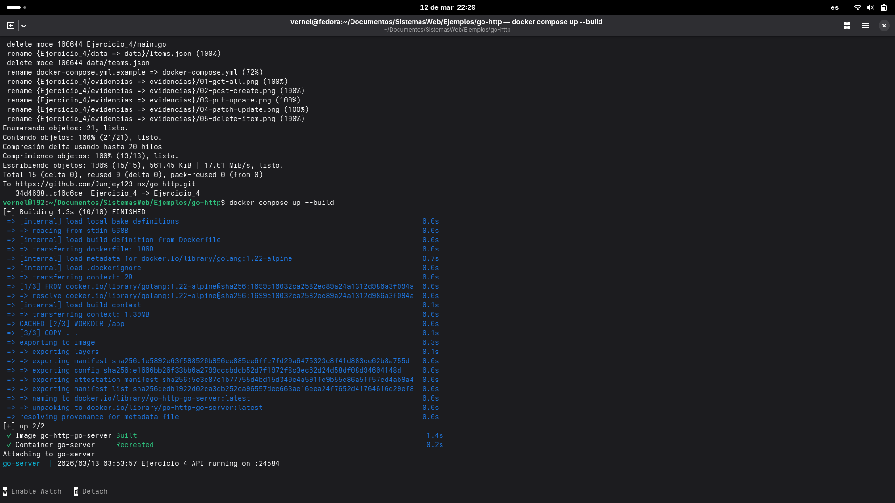

---

### Pruebas iniciales — puerto 8080

Las siguientes evidencias corresponden a las pruebas realizadas durante el desarrollo inicial del servidor corriendo en el puerto por defecto `8080`.

---

### 1. GET /api/items

Se realizó una petición `GET` al endpoint `/api/items` y la API respondió con estado `200 OK`, devolviendo la lista completa de canciones en formato JSON.

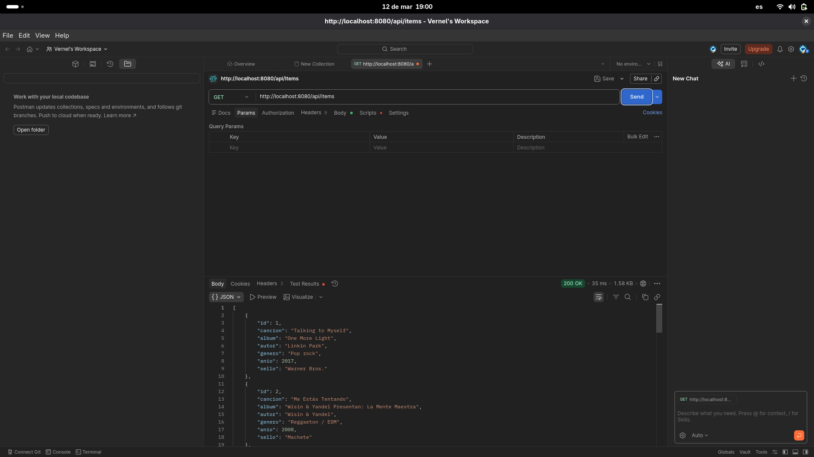

---

### 2. POST /api/items

Se realizó una petición `POST` enviando un nuevo registro en formato JSON.
La API respondió con `201 Created`, confirmando que el recurso fue creado correctamente.

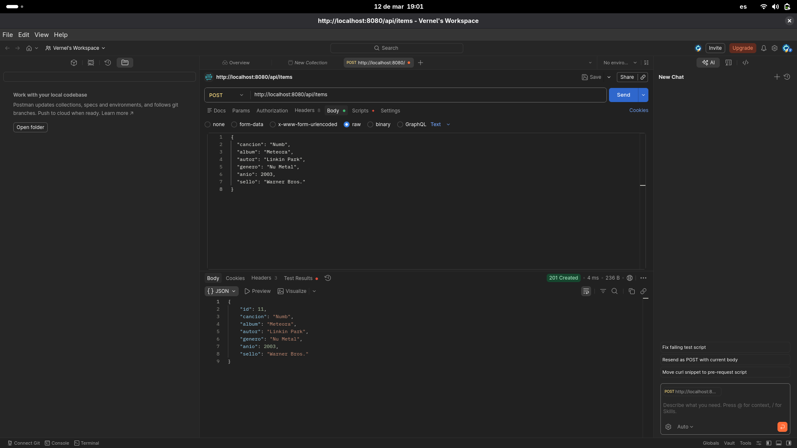

---

### 3. PUT /api/items/1

Se realizó una petición `PUT` para reemplazar completamente el recurso con id `1`.
La API respondió con `200 OK` y devolvió el objeto actualizado.

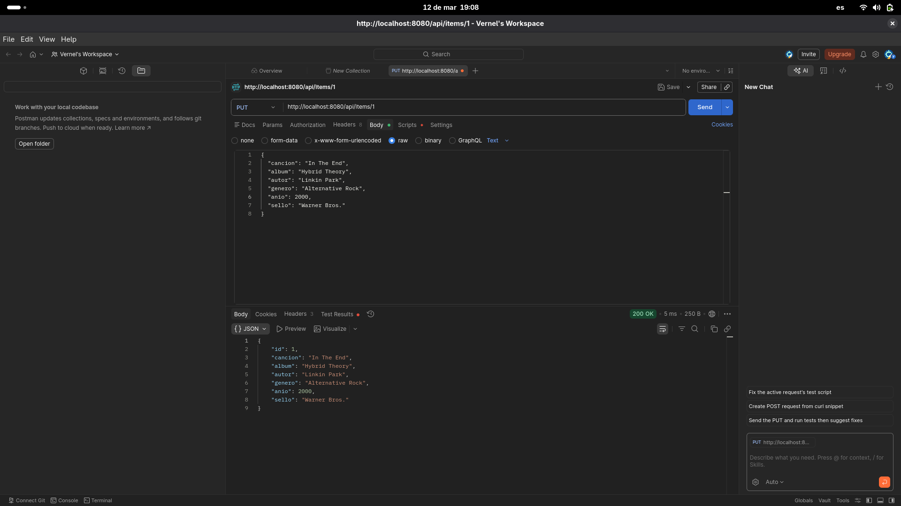

---

### 4. PATCH /api/items/1

Se realizó una petición `PATCH` para modificar parcialmente el recurso con id `1`.
La API respondió con `200 OK`, confirmando la actualización del registro.

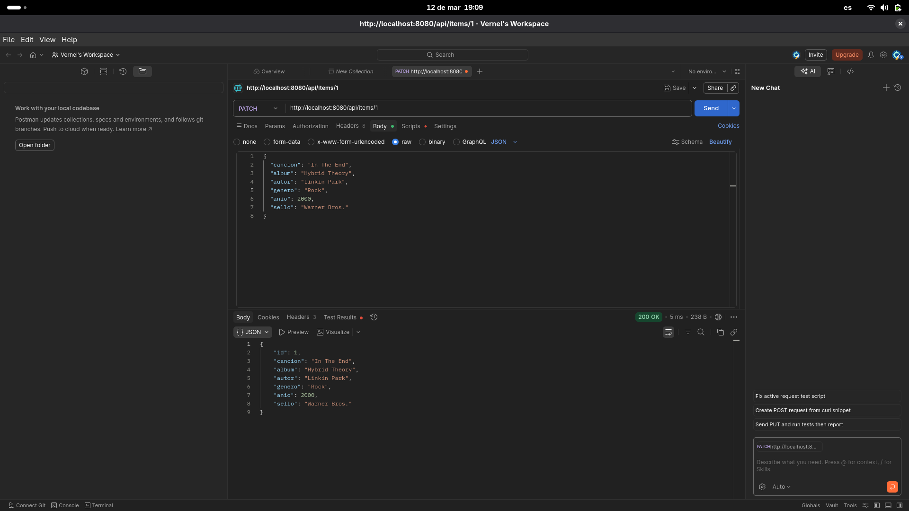

---

### 5. DELETE /api/items/10

Se realizó una petición `DELETE` sobre el recurso con id `10`.
La API respondió con `200 OK` y el mensaje `item deleted`, indicando que el registro fue eliminado correctamente.

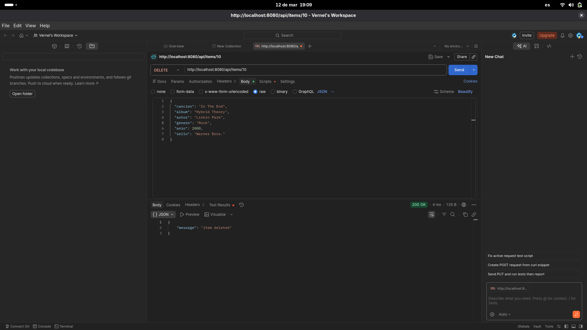

---

### Cambio de puerto al número de carnet

El servidor fue configurado para correr en el puerto **24584**, correspondiente al número de carnet del desarrollador. Se modificaron los siguientes archivos:

`main.go`:

```go
log.Println("Ejercicio 4 API running on :24584")
log.Fatal(http.ListenAndServe(":24584", nil))
```

`docker-compose.yml`:

```yaml
ports:
  - "24584:24584"
```

Las siguientes evidencias confirman que la API continuó funcionando correctamente tras el cambio de puerto.

---

### 6. GET /api/items — puerto 24584

Se realizó una petición `GET` al endpoint `/api/items` y la API respondió con estado `200 OK`, devolviendo la lista completa de canciones en formato JSON.

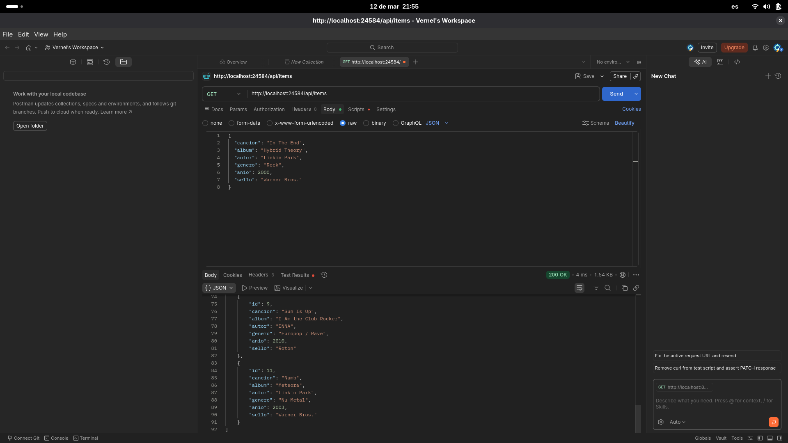

---

### 7. GET /api/items?id=1 — puerto 24584

Se realizó una petición `GET` usando el query parameter `id=1`.
La API respondió con `200 OK`, devolviendo únicamente la canción con id `1`.

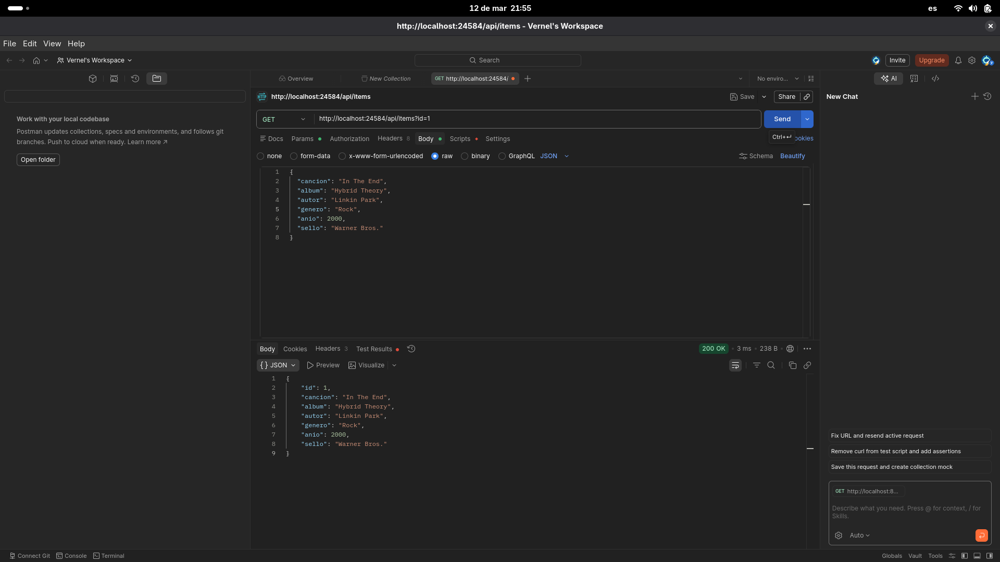

---

### 8. GET /api/items?autor=Eminem — puerto 24584

Se realizó una petición `GET` usando el query parameter `autor=Eminem`.
La API respondió con `200 OK`, devolviendo únicamente las canciones cuyo autor coincide.

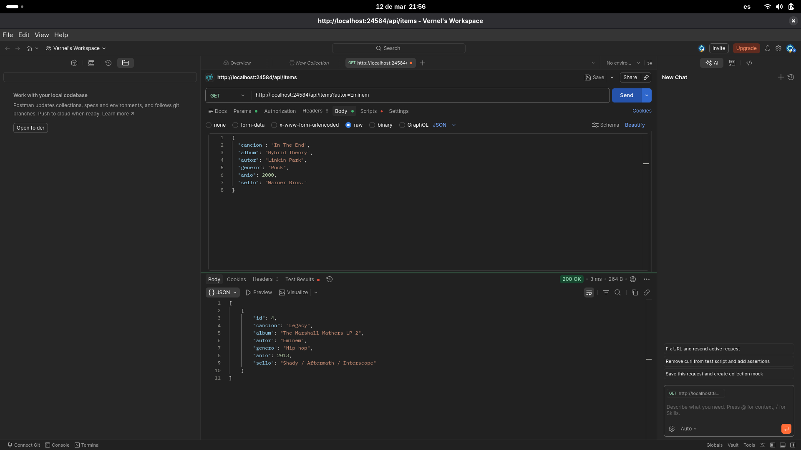

---

### 9. PUT /api/items/1 — puerto 24584

Se realizó una petición `PUT` para reemplazar completamente el recurso con id `1`.
La API respondió con `200 OK` y devolvió el objeto con los datos actualizados.

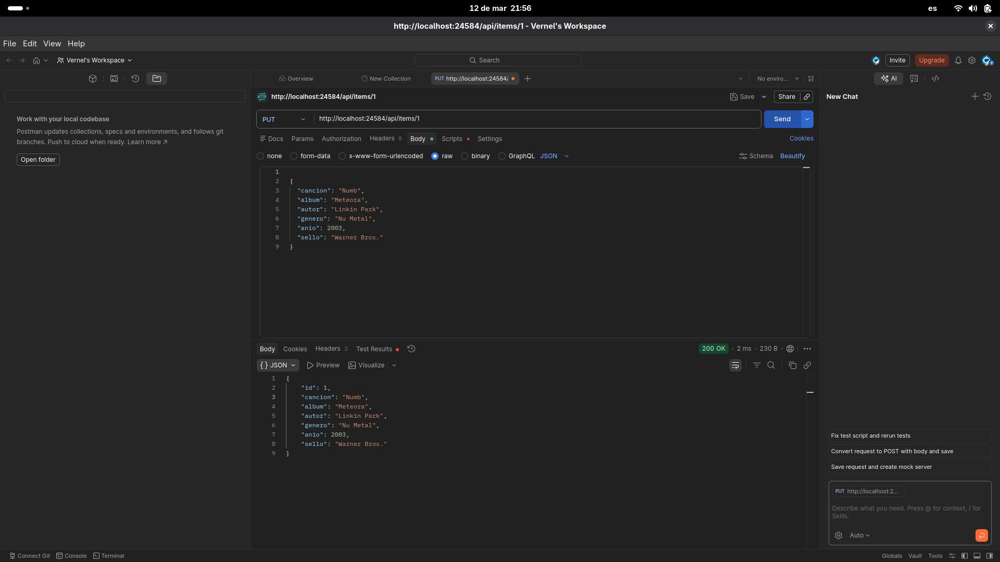

---

### 10. PATCH /api/items/1 — puerto 24584

Se realizó una petición `PATCH` enviando solo el campo `genero` con el valor `"Rock"`.
La API respondió con `200 OK`, actualizando únicamente ese campo y dejando el resto intacto.

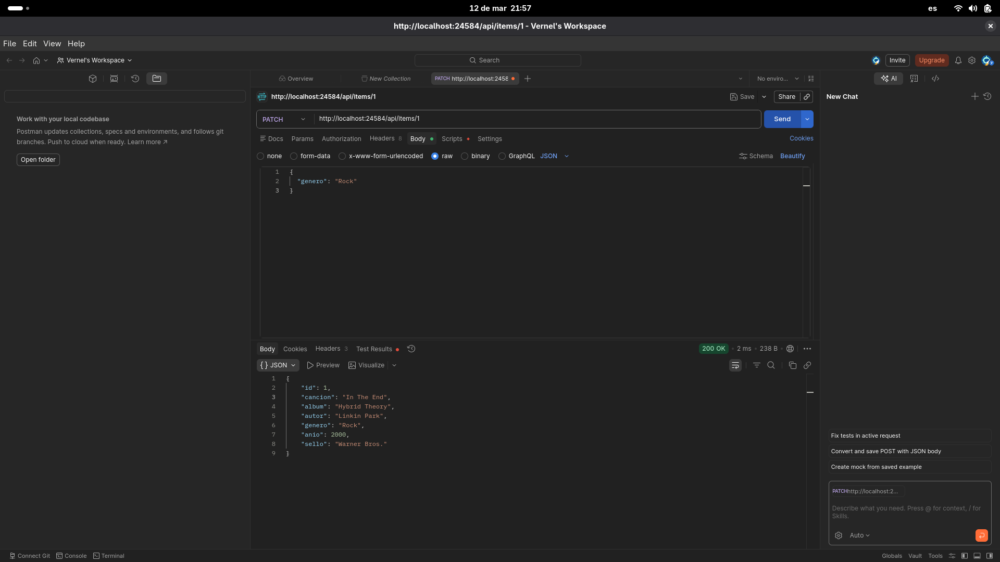

---

### 11. DELETE /api/items/1 — puerto 24584

Se realizó una petición `DELETE` sobre el recurso con id `1`.
La API respondió con `200 OK` y el mensaje `item deleted`, confirmando que el registro fue eliminado.

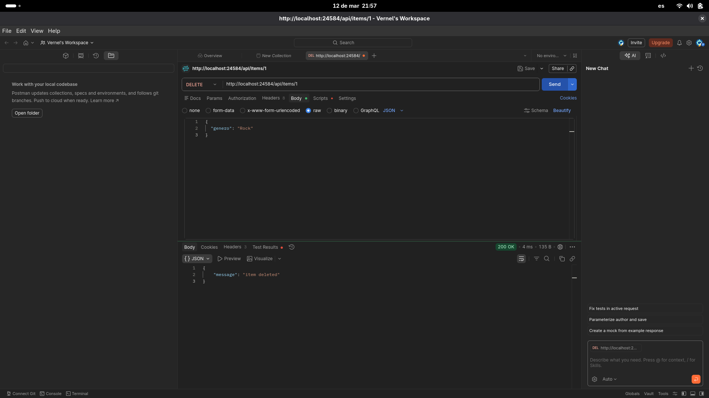

---

### 12. Caso de error — GET /api/items?id=999

Se realizó una petición `GET` con un id que no existe en los datos.
La API respondió con `404 Not Found` y el mensaje `{"error": "item not found"}`, demostrando el manejo consistente de errores con respuestas JSON estructuradas.

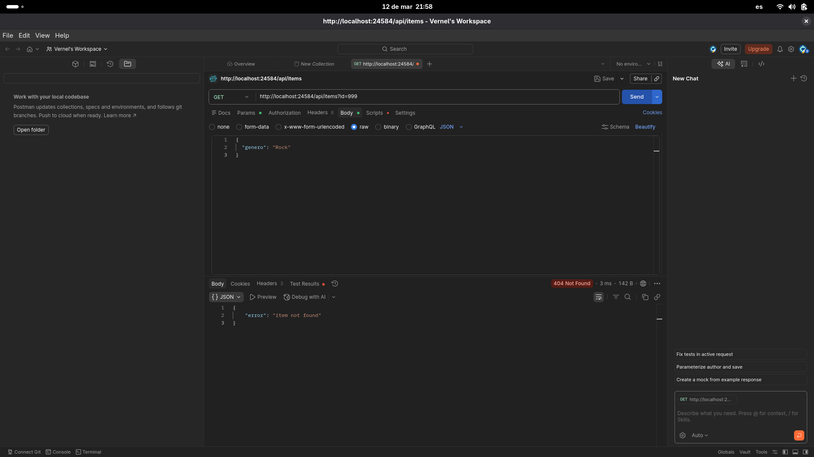

---

## Conclusión

Con estas evidencias queda demostrado el funcionamiento correcto de los cinco métodos HTTP principales solicitados, tanto en el puerto inicial `8080` como tras el cambio al puerto de carnet `24584`:

* `GET`
* `POST`
* `PUT`
* `PATCH`
* `DELETE`

---

## Ejecución

### Opción 1 — Go directamente

Requiere tener Go instalado en tu máquina.

```bash
# Asegurarse de estar en el directorio del ejercicio
cd Ejercicio_4

# Colocar el archivo de datos en la carpeta esperada (solo la primera vez)
mkdir -p data
cp items.json data/items.json

# Ejecutar el servidor
go run main.go
```

El servidor quedará escuchando en `http://localhost:24584`.

Para detenerlo presiona `Ctrl + C`.

---

### Opción 2 — Docker Compose

Requiere tener Docker y Docker Compose instalados.

```bash
# Asegurarse de estar en el directorio del ejercicio
cd Ejercicio_4

# Construir la imagen y levantar el contenedor
docker-compose up --build
```

El servidor quedará escuchando en `http://localhost:24584`.

Para detener y eliminar el contenedor:

```bash
docker-compose down
```